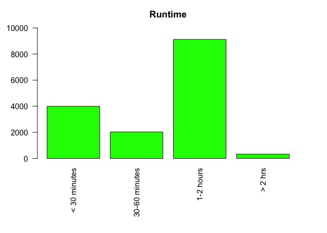

# INTRODUCTION

Netflix is one of the most popular streaming services with over 15,000
titles ranging from movies across various genres, original TV series’,
anime, documentaries, and everything in between. My final project is
going to focus on the content of Netflix and what you can learn from
this data.

## What

My final project is a statistical analysis report on Netflix data. I
found a public data set on kaggle.com that contains key information
(genre, language(s), rating, runtime, IMDb score, Rotten Tomatoes score,
etc) on over 15,000 titles on Netflix \[1\]. Within this report, you
will find graphs summarizing the various data columns, descriptive
statistics, correlations/relationships between variables, and
predictions.

## Why

When deciding on the topic for the final project, the only requirement I
had for myself was to focus on gaining more experience in R and to
practice the various aspects of statistics that we learned throughout
the semester (descriptive statistics, correlations/relationships, linear
regression, etc). Because my background is not in computer science,
statistics, or any related field, I wanted to make sure I had a solid
grasp on the basics instead of attempting a more advanced topic. I chose
to analyze a data set, read it into R, and gather statistics. I don’t
have a particular reason for choosing this particular topic (Netflix) or
data set other than I’m an avid Netflix watcher and I’m interested in
learning more about their content.

## How

To get started, I first downloaded the public data set and opened it
with Excel. The data set I chose to use for my final project contains 29
columns and over 15,000 rows. Originally, I intended to use all columns
of the data set, but I quickly realized this was too ambitious and more
complicated than my skill set would allow. Recognizing this, I deleted
18 columns of data that would help simplify the data imported into R and
limit the scope of the statistics that could be carried out in this
report. Then, I read the data into R using read.csv() and saved it as
MyData. This created an object in the R environment and allowed me to
create graphs and perform calculations.

# BODY: Summary of Data with Statistical Analysis

There is a lot of the data in this data set that is categorical. In
order to get a better understanding of the data and to see a graphical
representation of over 15,000 titles in the Netflix database, I started
with creating bar graphs for the five columns with categorical data:
Genre, Language, Movie vs. TV, Run time, and Rating. Then, I created
histograms and calculated the mean, median, and standard deviation for
the three columns with numerical data: IMDb Score, Rotten Tomatoes
Score, and Box office.

## Graphs and Descriptive Statistics

### Genre

    library(dplyr)
    library(tidyr)
    TheData <- read.csv(file="631FP_Netflix_Data.csv", header=TRUE, sep=",")
    EmptyGenres <- TheData %>% filter(Genre != "")
    SeperateGenres <- separate_rows(EmptyGenres, Genre, sep = ", ", convert = TRUE)
    par(mar=c(6,4,3,3))
    barplot(table(SeperateGenres$Genre), main="Genres", ylim = c(0, 7000), names.arg = c("Action", "Adult", "Adventure", "Animation", "Biography", "Comedy", "Crime", "Documentary", "Drama", "Family", "Fantasty", "Film-Noir", "Game-Show", "History", "Horror", "Music", "Musical", "Mystery", "News", "Reality-TV", "Romance", "Sci-Fi", "Short", "Sport", "Talk-Show", "Thriller", "War", "Western"), las = 2, col = "blue")

**Note:** this R chunk required the dplyr library for the %&gt;%
function and the tidyr library for the seperate\_rows function.

Based on this graph, it can be seen that Drama is the genre with the
most content on Netlfix. This is followed by Comedy, Thriller, and
Action. To see the exact number of titles within a specific genre, use a
table. For example, how many titles within Netflix are labeled “Comedy?”

    table(SeperateGenres$Genre)["Comedy"]

    ## Comedy 
    ##   5077

There are 5,077 titles on Netflix that are within the Comedy genre.

### Language

    EmptyLanguages <- TheData %>% filter(Languages != "")
    SeperateLanguage <- separate_rows(EmptyLanguages, Languages, sep = ", ", convert = TRUE)
    # table(SeperateLanguage$Languages)

There are many languages on Netflix. This makes creating a bar graph
challenging because there are too many categories to be represented on
the x-axis. Instead, the total number of languagees can be found by
finding the length of a table. Note: I do not have the table shown in
this report because it took up almost 3 pages and didn’t provide any
crucial information.

    LanguageTable <- table(SeperateLanguage$Languages)
    length(LanguageTable)

    ## [1] 192

There are 192 total languages represented on Netflix.

### Movie or TV Series

    EmptyMorTV <- TheData %>% filter(Series.or.Movie != "")
    barplot(table(EmptyMorTV$Series.or.Movie), main="Movie vs. TV Series", ylim = c(0, 13000), col = "red")

Based on the graph, you can see that there are significantly more movies
than TV series on Netflix. To find the exact proportions of movie and TV
series, a proportion table can be used.

    MovieOrTV <- table(EmptyMorTV$Series.or.Movie)
    prop.table(MovieOrTV)

    ## 
    ##     Movie    Series 
    ## 0.7556202 0.2443798

75.6% of content on Netflix is movies. 24.4% of content on Netflix is a
TV series.

### Runtime

    EmptyRun <- TheData %>% filter(Runtime != "")
    par(mar=c(8,4,3,3))
    barplot(table(EmptyRun$Runtime), main = "Runtime", names.arg = c("< 30 minutes", "30-60 minutes", "1-2 hours", "> 2 hrs"), ylim = c(0, 10000), las = 2, col = "green")

According to the table, a majority of the content on Netflix has a
runtime of 1-2 hours.

### Rating

    EmptyRating <- TheData %>% filter(View.Rating != "", View.Rating != "UNRATED", View.Rating != "E", View.Rating != "NOT RATED", View.Rating != "M/PG", View.Rating != "AL", View.Rating != "U", View.Rating != "E10+", View.Rating != "TV-13", View.Rating != "X", View.Rating != "MA-17", View.Rating != "GP", View.Rating != "M", View.Rating != "NC-17", View.Rating != "Approved", View.Rating != "Passed", View.Rating != "TV-Y7-FV")
    barplot(table(EmptyRating$View.Rating), main = "Ratings", names.arg = c("G", "Not Rated", "PG", "PG-13", "R", "TV-14", "TV-G", "TV-MA", "TV-PG", "TV-Y", "TV-Y7", "Unrated"), ylim = c(0, 2500), las = 2, col = "purple")

The most common rating is “R” followed by “PG-13,” “Not Rated,” and
“TV-MA.” Again, the exact numbers for each rating can be found using a
table.

    RatingsTable <- table(EmptyRating$View.Rating)
    RatingsTable["R"]

    ##    R 
    ## 2096

    RatingsTable["PG-13"]

    ## PG-13 
    ##  1373

    RatingsTable["TV-MA"]

    ## TV-MA 
    ##  1136

    RatingsTable["Not Rated"]

    ## Not Rated 
    ##      1320

There are 2,096 titles with an “R” rating, 1,373 titles with a “PG-13”
rating, 1,320 titles with a “Not Rated rating, and 1,136 titles with
a”TV-MA” rating.

### IMDb Score

    hist(TheData$IMDb.Score, main = "IMDb Score", xlab = "IMDb Score", col = "pink")

The above graph displays a distribution of the IMDb Scores of Netflix
content. Looking at the graph, it can be seen that the distribution is
unimodal with a slight left-skew. Below is the mean, median, and
standard deviation for IMDb Score.

#### Mean

    mean(TheData$IMDb.Score, na.rm = TRUE)

    ## [1] 6.496054

The average IMDb score is 6.496.

#### Median

    median(TheData$IMDb.Score, na.rm = TRUE)

    ## [1] 6.6

The middle value or median in the data set is 6.6. The mean is less than
the median, which means that the data is left-skewed. This can be
confirmed by the above graph.

#### Standard Deviation

    sd(TheData$IMDb.Score, na.rm = TRUE)

    ## [1] 1.14691

The standard deviation is 1.147

### Rotten Tomatoes Score

    hist(TheData$Rotten.Tomatoes.Score, main = "Rotten Tomatoes Score", xlab = "Rotten Tomatoes Score", col = "yellow", breaks = 20)

The above graph displays a distribution of the Rotten Tomatoes Scores of
Netflix content. Looking at the graph, it can be seen that the
distribution is unimodal with a left-skew.Below is the mean, median, and
standard deviation.

### Mean

    mean(TheData$Rotten.Tomatoes.Score, na.rm = TRUE)

    ## [1] 59.52303

The average Rotten Tomatoes score is 59.523

### Median

    median(TheData$Rotten.Tomatoes.Score, na.rm = TRUE)

    ## [1] 64

The middle value or median in the data set is 64. The mean is less than
the median, which means that the data is left-skewed. This can be
confirmed by the above graph.

### Standard Deviation

    sd(TheData$Rotten.Tomatoes.Score, na.rm = TRUE)

    ## [1] 26.99917

The standard deviation is 26.999.

### Box Office

    EmptyBoxoffice <- TheData %>% filter(Boxoffice != "")
    EmptyBoxoffice$Boxoffice = gsub("\\$", "", EmptyBoxoffice$Boxoffice)
    EmptyBoxoffice$Boxoffice = gsub("\\,", "", EmptyBoxoffice$Boxoffice)
    hist(as.numeric(EmptyBoxoffice$Boxoffice), main = "Box Office", xlab = "Box Office Total", col = "orange", breaks = 20)

The above graph displays a distribution of the Box Office Totals for the
titles on Netflix that were shown in theaters. Looking at the graph, it
can be seen that the distribution is unimodal with heavy right-skew.
Below is the mean, median, and standard deviation.

### Mean

    mean(as.numeric(EmptyBoxoffice$Boxoffice), na.rm = TRUE)

    ## [1] 45682292

The average box office total is 45,682,292.

### Median

    median(as.numeric(EmptyBoxoffice$Boxoffice), na.rm = TRUE)

    ## [1] 19551067

The middle value or median is 19,551,067. The mean is significantly more
than the median, which means that the data is heavily right-skewed. This
can be confirmed by the above graph.

### Standard Deviation

    sd(as.numeric(EmptyBoxoffice$Boxoffice), na.rm = TRUE)

    ## [1] 70976344

The standard deviation is 70,976,344.

## Correlations/Relationships

To summarize the relationships between the numerical data, scatter plots
were created and then analyzed.

### IMDb Score and Box Office

    FilterIMDb <- TheData %>% filter(IMDb.Score != "")
    FilterIMDbandBox <- FilterIMDb %>% filter(Boxoffice != "")
    FilterIMDbandBox$Boxoffice = gsub("\\$", "", FilterIMDbandBox$Boxoffice)
    FilterIMDbandBox$Boxoffice = gsub("\\,", "", FilterIMDbandBox$Boxoffice)
    plot(x= FilterIMDbandBox$IMDb.Score, y= as.numeric(FilterIMDbandBox$Boxoffice), xlab = "IMDb Score", ylab = "Box Office")

Based on the above graph, the relationship between IMDb Score and Box
Office is nonlinear. The graph looks similar to a bell curve. There
appears to be a peak of Box Office earnings around an IMDb score of 7.
The majority of data falls within this curve; however, there appear to
be some outliers. A few of the highest earning titles have IMDb scores
closer to 8 or 9. These outliers could be due to a number of factors
including popular or A-list actors, higher filming budget, unique
marketing, etc.

### Rotten Tomatoes Score and Box Office

    FilterRotten <- TheData %>% filter(Rotten.Tomatoes.Score != "")
    FilterRottenandBox <- FilterRotten %>% filter(Boxoffice != "")
    FilterRottenandBox$Boxoffice = gsub("\\$", "", FilterRottenandBox$Boxoffice)
    FilterRottenandBox$Boxoffice = gsub("\\,", "", FilterRottenandBox$Boxoffice)
    plot(x= FilterRottenandBox$Rotten.Tomatoes.Score, y= as.numeric(FilterRottenandBox$Boxoffice), xlab = "Rotten Tomatoes Score", ylab = "Box Office")

Based on the above graph, there does not appear to be a correlation
between Box Office and Rotten Tomatoes Score. The data falls on a
horizontal line along the x-axis. The Rotten Tomatoes score does not
appear to have an effect on the Box Office earnings.

### IMDb Score and Rotten Tomatoes Score

    IMDbvsRotten <- TheData %>% filter(IMDb.Score != "" & Rotten.Tomatoes.Score != "")
    plot(x= IMDbvsRotten$Rotten.Tomatoes.Score, y= IMDbvsRotten$IMDb.Score, xlab = "Rotten Tomatoes Score", ylab = "IMDb Score")

Based on the scatter plot, it can be seen that IMDb Score and Rotten
Tomatoes Score have a positive linear relationship. Although there are
some outliers, the variation remains constant and the majority of data
lies along the line.

Because the relationship is linear, the assumptions (conditions) of
linear regression were checked to see if they were met in order to apply
the linear regression model.

Assumptions of Linear Regression: 1. The Y-values, errors, are
independent. 2. The y values can be expressed as a linear function of
the x variable. 3. The variations around the regression line is
constant. 4. The y values (or residuals) are normally distributed.\[2\]

Notice in the code below the Rotten Tomatoes Score has been divided by
10. This accounts for the IMDb being out of 10 and Rotten Tomatoes being
out of 100. Now the two scores are comparable which allows for more
accurate calculations and plots.

    AdjustScore <- IMDbvsRotten$Rotten.Tomatoes.Score / 10
    LinReg <- lm(IMDbvsRotten$IMDb.Score ~ AdjustScore)
    par(mfrow = c(2, 2))
    plot(LinReg)

The first assumption, independence of the residuals, is true. The IMDb
scores are not dependent on the Rotten Tomatoes score.

In the first graph (the residual plot), it can be seen that the
linearity assumption is met as the red-line is flat meaning that there
is no pattern. It can also be seen that the variation of residuals is
constant.

In the second graph (Q-Q plot), it can be seen that the y values are
normally distributed because the points fall roughly on a diagonal line.

All four conditions of linear regression are met, so the model can be
applied.

    summary(LinReg)

    ## 
    ## Call:
    ## lm(formula = IMDbvsRotten$IMDb.Score ~ AdjustScore)
    ## 
    ## Residuals:
    ##     Min      1Q  Median      3Q     Max 
    ## -4.9899 -0.3939  0.0790  0.4599  3.6180 
    ## 
    ## Coefficients:
    ##             Estimate Std. Error t value Pr(>|t|)    
    ## (Intercept) 4.829960   0.021941  220.14   <2e-16 ***
    ## AdjustScore 0.270764   0.003357   80.66   <2e-16 ***
    ## ---
    ## Signif. codes:  0 '***' 0.001 '**' 0.01 '*' 0.05 '.' 0.1 ' ' 1
    ## 
    ## Residual standard error: 0.7232 on 6367 degrees of freedom
    ## Multiple R-squared:  0.5054, Adjusted R-squared:  0.5053 
    ## F-statistic:  6506 on 1 and 6367 DF,  p-value: < 2.2e-16

The slope and intercept can be found using the summary table above.

**The line of regression is y = 0.271x + 4.83** Below is the scatter
plot with the line of regression in red.

    plot(x= IMDbvsRotten$Rotten.Tomatoes.Score, y= IMDbvsRotten$IMDb.Score, xlab = "Rotten Tomatoes Score", ylab = "IMDb Score")
    abline(LinReg, col = "red")

# Topics from Class

## Topic 1: R Markdown

During the semester, we learned R Markdown through homework, quizzes,
and hand-on activities. I utilized many of the topics taught during
class including barplots, histograms, scatterplots, descriptive
statistics, and linear regression. In addition to what we learned in
class, I also used a few other functions of R: tidyr (tidyverse) and
dplyr. Because many of the columns in my dataset were multivalued, they
needed to be separated so each value had it’s own row. This required the
use of tidyverse and the seperate\_rows function. Once the values were
separated into their own rows, barplots for the categorical data could
be properly executed. The data set also had many cells that were empty
(NULL), which made calculating mean, median, and standard deviation
impossible unless those rows could be temporarily filtered out of the
dataset. For example, when calculating the mean of the IMDb score, I
filtered out the titles on Netflix that did not have a IMDb score first,
and then calculated the mean. One challenge I came across in R was
trying to access a particular instance within a table. I wanted to find
the max value in the Languages table, but every time I tried to use the
value as an index, I kept getting “NA.” I Googled the problem and tried
every solution that I could find, but kept getting “NA,” so I moved on
and chose to show the analysis differently. Through this project, I
gained a lot more experience with R and feel much more comfortable with
many of the commands and how they work.

## Topic 2: Github

We learned the basics of Github during class, which I utilized to turn
in the draft of this final project. I created a new repository on
Github, copied the link, pasted it into a new project on R, then
committed it, and lastly pushed the commit to Github using an
authentication token. I have minimal experience with Git, so I followed
the instructions on Canvas. In the past, I learned how to use Git with
Terminal, but using it with R is new to me. In the past, I pushed
projects to Git through terminal commands. Although we did not spend
much time with Github during this semester, I plan to explore it further
outside of class.

## Topic 3: Summarizing Data

In chapter two of the textbook, we learned about summarizing numerical
and categorical data \[2\]. At the beginning of this report, I used bar
plots, contingency tables, and one proportion table to summarize the
categorical data of the Genre, Languages, Movie vs TV Series, Ratings,
and Runtime columns of the Netflix data. Then, I used histograms to show
the data density of numerical data of the IMDb Score, Rotten Tomatoes
Score, and Box Office columns. I was also able to determine the
distribution of the numerical data using the histograms. Lastly, to
visualize the relationships between the numerical data, I used
scatterplots. This allowed me to determine the kind of relationship
occurring between the various numerical data. Although these topics are
fairly simple, I found it helpful to practice creating these graphs in R
multiple times. I encountered many errors, but I was able to solve them
with trial and error, which is a rewarding process. Analyzing graphs is
also an important skill, which I was able to gain experience in during
the analysis of the Netflix data.

## Topic 4: Descriptive Statistics

Descriptive statistics generally refers to measures of central tendency
and measures of variability, so mean, median, mode, and standard
deviation \[2\]. In this report, I focused on the mean, median, and
standard deviation of the three columns of numerical data: IMDb Score,
Rotten Tomatoes Score, and Box Office. Once I calculated these values, I
provided a brief analysis of what the value means in terms of the
overall data set. Again, these topics are fairly simple, but because I
am new to statistics, I found it helpful to gain experience calculating
and analyzing the data using basic, but core calculations in data
analysis.

## Topic 5: Linear Regression

Linear regression attempts to model a linear relationship between two
numerical variables, an explanatory (x) and response (y) variable. We
learned about this topic during lecture and it was also discussed in our
textbook \[2\]. In the report above, I performed linear regression and
found the line of best fit for the relationship between IMDb Score
(response variable) and Rotten Tomatoes Score (explanatory variable).
This was only done once I discovered that the four assumptions of linear
regression were met. If one of the conditions was not true, then I would
not have attempted to model the relationship. Despite reading the
textbook and listening to lecture, I still found this concept a bit
confusing. However, I wanted to challenge myself to at least attempt
linear regression in this report, so I replayed the lecture that went
over linear regression in R and then gave it a shot. Although I am not
sure if I did it correctly, I learned a lot and gained experience on
this topic.

# Conclusion

As I mentioned earlier, my background is not in a statistics-related
field, so a majority of the content in this class was new to me. For
this reason, I wanted my final project to focus on the basics of both R
and statistics. This project allowed me spend more time exploring R
commands/functions, descriptive statistics, distributions, correlations,
relationships between variables, simple probabilities, and linear
regression. Before starting the final project, I was still struggling
with R because it is much different from other coding languages. I found
myself constantly referring to old assignments in order to remember how
to execute commands or use and understand functions. After the final
project, I feel like I have a much firmer grasp on the basics of R and
even a few advanced features (data cleaning). I’m now able to code
commands and functions from memory and I know what they do and how as
opposed to executing functions because the assignment told me to do it
in order to get the desired result. In addition to gaining knowledge in
R, I also have a better understanding of descriptive statistics
(especially distribution and standard deviation) and linear regression.
This project forced me to dive deeper into these concepts in order to
understand the Netflix data well enough to analyze and describe the
results. While I’m still not an expert in R or statistics by any means,
I feel much more confident in my skills in R and my ability to perform
basic statistical calculations.

# References

\[1\] Gupta, Ashish. netflix-rotten-tomatoes-metacritic-imdb. Kaggle,
2021. Web. 18 April 2022.
<https://www.kaggle.com/datasets/ashishgup/netflix-rotten-tomatoes-metacritic-imdb?resource=download>

\[2\] Diez, David, Cetinkaya-Rundel, Mine, Barr, Christopher D.
OpenIntro Statistics. 4th ed., OpenIntro, 2019.
